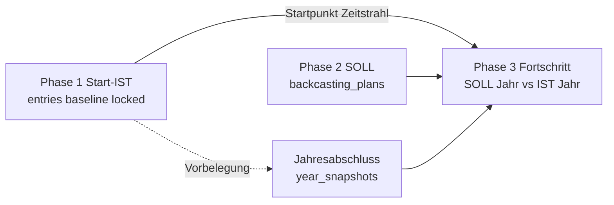

# Jahresabschluss – Konzept

## Datenfluss

## Rollen der Ebenen

| Ebene | Tabelle / Ort | Bedeutung |
|-------|----------------|-----------|
| Phase 1 | `entries` | Einmalige **Ausgangslage** (Kick-off). Nach `baseline_locked` nur noch Admin editierbar. |
| Phase 2 Plan | `backcasting_plans` | **SOLL** je Planjahr (Meilensteine `p1Year`). |
| Jahresabschluss | `year_snapshots` | **IST erreicht** je abgeschlossenem Jahr (`unit` + `year`, Status `draft` / `closed`). |
| Phase 3 | Dashboard-APIs | Vergleich `SOLL[year]` mit `IST` aus abgeschlossenem Jahresabschluss. |

## API

| Methode | Route | Zweck |
|---------|-------|--------|
| GET | `/api/year-snapshots?unit=` | Liste aller Jahre + Status |
| GET | `/api/year-snapshots/:year?unit=` | Snapshot + Plan-Hinweise |
| GET | `/api/year-snapshots/:year?prefill=1` | Vorbelegung (Vorjahr oder Baseline) |
| PUT | `/api/year-snapshots/:year` | Entwurf speichern |
| POST | `/api/year-snapshots/:year/close` | Abschließen + Baseline fixieren |
| GET | `/api/units/:unit/baseline-status` | Baseline-Status |
| POST | `/api/units/:unit/baseline/lock` | Baseline manuell fixieren |
| POST | `/api/units/:unit/baseline/unlock` | Nur Admin |

## UI

- **Erfassung:** Phase 2 → Tab „⑥ Jahresabschluss“ (`/backcasting/?tab=jahresabschluss`)
- **Baseline fixieren:** Phase 1 → Banner mit Button (oder automatisch beim ersten Abschluss)
- **Fortschritt:** Jahr-Filter zeigt Status (offen / Entwurf / abgeschlossen); Hinweis wenn IST fehlt

## Zeitstrahl

- **Start-IST:** Baseline am `planningStartYear`
- **Weitere Punkte:** abgeschlossene `year_snapshots` pro Jahr
- Keine lineare IST-Projektion mehr, wenn Jahres-IST fehlt → Punkt leer / Hinweis „IST offen“
